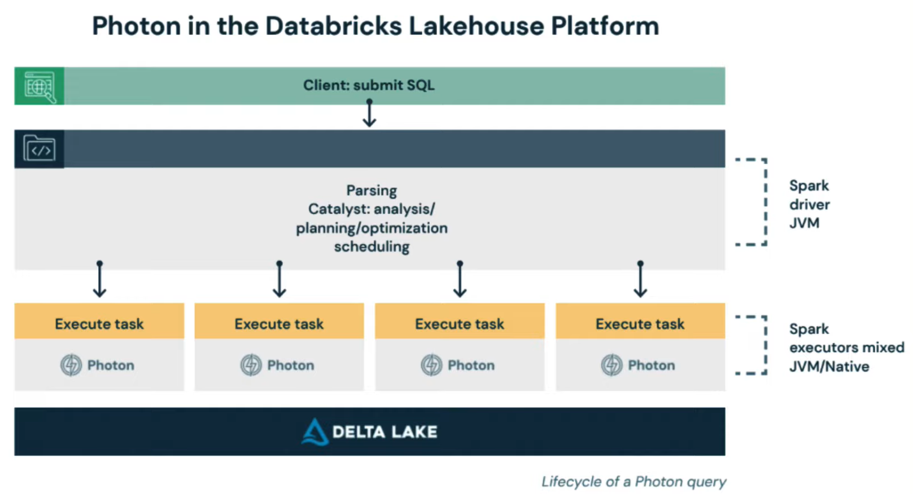
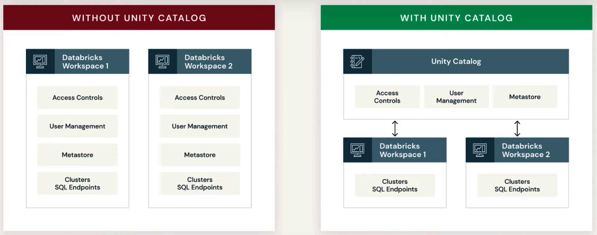

# Data Lakehouse Platform Architecture and Security

- Why is data reliability and performance important ?
bad data in = bad data out

### Problems when using data lakes:
- Lack of ACID support
- Lack of schema enforcement
    - Creates inconsistent and low quality data
- Lack of integration with a data catalog
    - Resulting in no single source of truth
- As for performance, using object storage means dat is mostly kept in immutable files:
    - Ineffective partitioning
    - Too many small files

### Delta Lake
- ACID transaction guarantess
- Scalable adata and metadata handling
    - Leveraging spark to scale out all the metadata processing 
- Audit history and time travel
    - Provides a transaction log with details about every change to data
    - Ability to revert to earlier versions for rollbacks or to reproduce experiments
- Schema enforcement and schema evolution
- Support for deletes, updates and merges
    - This allows complex use cases:
        - Change data capture
        - Slowly changing dimension operations
        - Streaming upserts
        - ...
- Unified streaming and batch processing

- Additional points
    - Compatible with Apache Spark
    - Uses Delta Tables
        - based on Apache Parquet
        - Switching from Parquet to data is really easy
    - Transaction log
        - Records every transaction
        - Acts as a single source of truth, so it always presents users with correct views of the data
        - When a user reads a delta lake table for the first time or runs a new query on an open table, spark checks the transaction log for new transactions that have been posted to the table, if a change exists, spark updates the table. This ensures users are working with the most up-to-date information and the user table is synchonized with the master record and also prevents the user from making conflicting changes to the table. 

 

## Photon

To support the lakehouse paradigm, the execution engine has to provide the same performance as a data warehouse while still having the scalability of a data lake. The solution is **Photon**.

Photon is the next generation query engine. It provides dramatic infrastructure cost savings over the traditional databricks runtime Spark.

It is compatible with Spark APIs, implementing a more general execution framework for efficient processing of data. 

With Photon you see increased speed for use cases such as data ingestion, ETL, streaming data, ... 

 

## Unified governance and security

### Challenges to data and AI geoverance
- Diversity of data and AI assets
    - Data takes many forms beyond files and tables to complex structures such as dashboards, ML models, ...
- Using two disparate and incompatible data platforms
    - Businesses are forced to use data warehouses for BI and data lakes for AI, resulting in data duplication and unsynchronized governance models.
- Rise of multi-cloud adoption
    - Each cloud has a unique governance model that requires individual familiarity
- Fragmented tool usage for data governance
    - Introduces complexity in multiple integration points in the system leading to poor performance

### How the Databricks Data Lakehouse Platform solves this

#### Unity catalog
- Provides a common governance model based on ANSI SQL to define and enforce fine-grained access control on all data and AI assets on any Cloud

- Single source of truth for all user identities and data assets
- It provides a single access point with a common interface for collaboration from any workspace in the platform, removing data team silos
- Allows to restrict access to certain rows and columns to users or groups authorized to query them.
- Attribute-based access control allows to further simplify geovernance at scale by controlling access to multiple data items at one time. For example, personally identifiable information in multiple given columns can be tagged as such and a single rule can restrict or provide access as needed.
- Highly detailed audit trail

