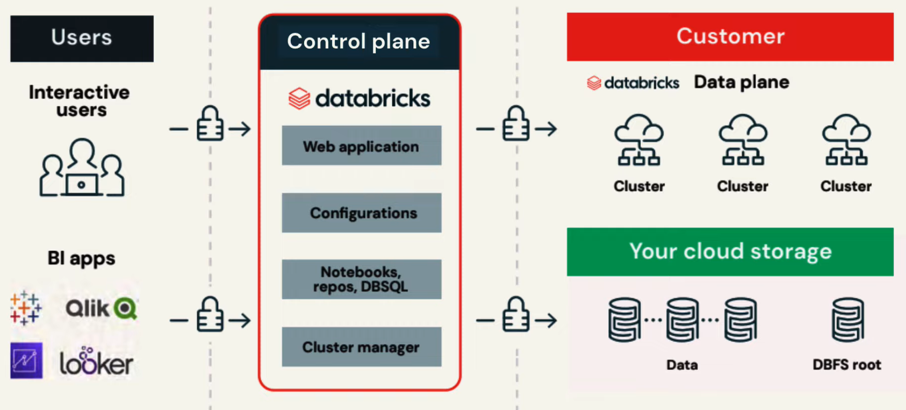
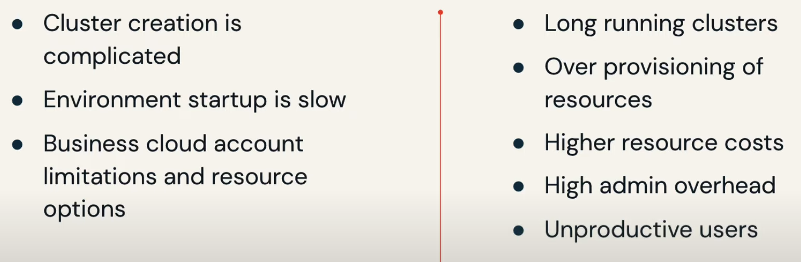
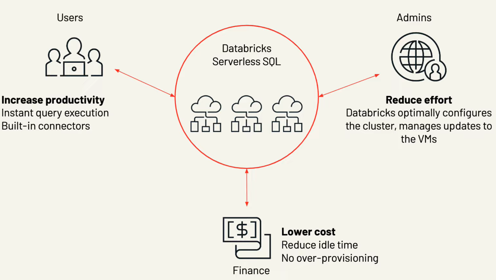

# Data Lakehouse Platform Architecture and Security

- Why is data reliability and performance important ?
bad data in = bad data out

### Problems when using data lakes:
- Lack of ACID support
- Lack of schema enforcement
    - Creates inconsistent and low quality data
- Lack of integration with a data catalog
    - Resulting in no single source of truth
- As for performance, using object storage means dat is mostly kept in immutable files:
    - Ineffective partitioning
    - Too many small files

### Delta Lake
- ACID transaction guarantess
- Scalable adata and metadata handling
    - Leveraging spark to scale out all the metadata processing 
- Audit history and time travel
    - Provides a transaction log with details about every change to data
    - Ability to revert to earlier versions for rollbacks or to reproduce experiments
- Schema enforcement and schema evolution
- Support for deletes, updates and merges
    - This allows complex use cases:
        - Change data capture
        - Slowly changing dimension operations
        - Streaming upserts
        - ...
- Unified streaming and batch processing

- Additional points
    - Compatible with Apache Spark
    - Uses Delta Tables
        - based on Apache Parquet
        - Switching from Parquet to data is really easy
    - Transaction log
        - Records every transaction
        - Acts as a single source of truth, so it always presents users with correct views of the data
        - When a user reads a delta lake table for the first time or runs a new query on an open table, spark checks the transaction log for new transactions that have been posted to the table, if a change exists, spark updates the table. This ensures users are working with the most up-to-date information and the user table is synchonized with the master record and also prevents the user from making conflicting changes to the table. 

 

## Photon

To support the lakehouse paradigm, the execution engine has to provide the same performance as a data warehouse while still having the scalability of a data lake. The solution is **Photon**.

Photon is the next generation query engine. It provides dramatic infrastructure cost savings over the traditional databricks runtime Spark.

It is compatible with Spark APIs, implementing a more general execution framework for efficient processing of data. 

With Photon you see increased speed for use cases such as data ingestion, ETL, streaming data, ... 

 

## Unified governance and security

### Challenges to data and AI geoverance
- Diversity of data and AI assets
    - Data takes many forms beyond files and tables to complex structures such as dashboards, ML models, ...
- Using two disparate and incompatible data platforms
    - Businesses are forced to use data warehouses for BI and data lakes for AI, resulting in data duplication and unsynchronized governance models.
- Rise of multi-cloud adoption
    - Each cloud has a unique governance model that requires individual familiarity
- Fragmented tool usage for data governance
    - Introduces complexity in multiple integration points in the system leading to poor performance

### How the Databricks Data Lakehouse Platform solves this

#### Unity catalog
- Provides a common governance model based on ANSI SQL to define and enforce fine-grained access control on all data and AI assets on any Cloud

- Single source of truth for all user identities and data assets
- It provides a single access point with a common interface for collaboration from any workspace in the platform, removing data team silos
- Allows to restrict access to certain rows and columns to users or groups authorized to query them.
- Attribute-based access control allows to further simplify geovernance at scale by controlling access to multiple data items at one time. 
  - For example, personally identifiable information in multiple given columns can be tagged as such and a single rule can restrict or provide access as needed.
- Highly detailed audit trail
- Much faster metadata processing when compared to Hive metastore

 

## Delta sharing

- Open source solution to share live data from your Lakehouse to any computing platform securely.
- Recipients don't have to be on the same cloud or even use the Databricks Lakehouse platform.

### Key benefits
- Open cross-platform sharing
    - Native integration with PowerBI, Tableau, Spark, pandas and Java
- Share live data without copying it
- Centralized administration and governance
  - Governed, tracked and audited from a single location
  - Allowing usage to be monitored at the table, partition and version level
- Marketplace for data products
- Privacy-safe data clean rooms
  - Meaning collaboration between data providers and recipients is hosted in a secure environment while safeguarding data privacy

- Unity catalog natively supports Delta sharing:

 

## Security

Two separate planes:
- Control plane
- Managed backend services that databricks provides
  - These live in databricks own cloud account
  - They are aligned with whatever cloud service the customer is using
- Data plane
  - where your data is processed
  - You can choose to run the compute resources in:
    - your business owner own cloud account
    - serverless

- All data stays in the data plane except for Notebooks, Configuration logs and user information that are available in the control plane.
- The information is encrypted at rest and communication to/from the control plane is encrypted in transit

### Security of the data plane

#### Networking
- If the business decides to host the data plane, databricks will configure the networking by default
- The serverless data plane networking infrastructure is managed by databricks in a databricks cloud service provider account and shared among customers with additional network boundaries between workspaces and clusters

#### Servers
- Databricks clusters are run using the latest hardened system images 
- Clusters are short-lived, often terminated after a job and do not persist data after termination
- Code is launched in an unprivileged container

#### Databricks
- Databricks access to the environment is limited to cloud service provider APIs for automation and support access
- Custom-built system allowing databricks staff to fix issues or handle support requests

### User identity and access
- table ACLs feature
  - traditional SQL based statements to manage access to data and enable fine-grained view-based access
- IAM instance profiles
  - enable AWS clusters to assume an IAM role so users of that cluster access allowed resources automatically
- Securely stored access key
- The Secrets API

### Instant compute and serverless

Compute resource challenge

To solve this problems, databricks has released the serverless compute option.

- Three layers of isolation
  - The container hosting the runtime
  - The VM hosting the container
  - The Virtual Network for the workspace

With no sharing and no cross-network traffic allowed ensuring your work is secure.
When finished, the VM is terminated and deleted and a new VM is released back into the pool of waiting resources.

 

## Data management terminoligy
