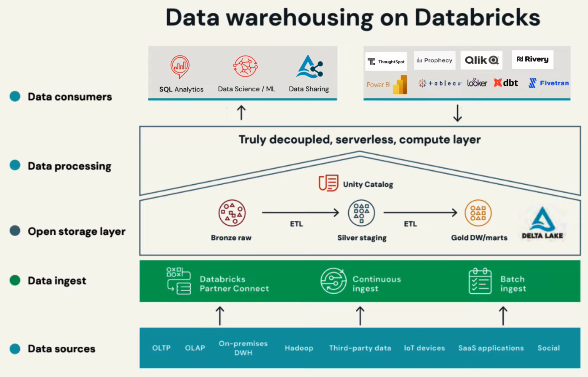

# Supported Workloads on the Databricks Lakehouse Platform

## Data Warehousing

We know that traditional data warehouses are no longer able to keep up with the needs of today's world. 

- With this approach (Data warehouse for BI and Data Lake for AI/ML) used by some organizations, lots of challenges come to light to provide value from the data in a timely or cost effective manner.

The databricks Lakehouse Platform provides several features to support the data warehousing workload
- Warehousing workload refers to:
    - SQL analytics
    - BI tasks
        - Ingest, transform and query data
        - Building dashboards

These tasks are supported by databricks SQL and serverless SQL

 

## Data Engineering

- Data engineering workload refers to:
    - Ingesting, transforming and orchestrating data out to different data teams
 

#### Challenges for the data engineering workload:
- Complex data ingestion methods
- Support for data engineering principles
    - Agile development methods
    - Isolated development and production environments
    - CI/CD
    - Version control transformations
- Third-party orchestration tools
    - Increases operational overhead
    - Decreases reliability
- Pipeline and architecture performance tuning
    - Requires ...
        - knowledge of the underlying architecture
        - constantly observing throughput parameters
- Inconsistencies between data warehouse and data lake providers

#### Key capabilities of data engineering on the lakehouse
- Easy data ingestion
- Automated ETL pipelines
    - help reduce development time and effort
    - data engineers can focus on implementing business logic and data quality checks
- Data quality checks
- Batch and streaming tuning
    - data latency can be tuned with cost controls
- Automatic recovery
    - recover from common errors during pipeline execution
- Data pipeline observability
    - monitor overall pipeline status
- Simplified operations
    - easily deploy data pipelines to production
    - roll back pipelines and minimize downtime
- Scheduling and orchestration

#### Data ingestion
- As data loads into the delta lake, databricks automatically infers the schema

##### AutoLoader
Optimized data ingestion tool that processes new data files as they arrive in the lake house cloud storage.

It auto detects the schema and enforces it on your data.
Data ingestion for data analysts is easy with the *COPY INTO* SQL command that loads data from a folder into de Delta lake table. When run, only new files from the source will be processed.

#### Data transformation
##### Delta live tables
- ETL framework that uses a simple declarative approach to building reliable data pipelines
- Automatically autoscales infrastructure
- Data Engineers treat their data as code and apply software engineering best practices to deploy reliable pipelines at scale.
- Supports Python and SQL 
- Supports streaming and batch workloads

#### Databricks Workflows
Fully managed orchestration service that allows data teams to build reliable workflows on any cloud without needing to manage a complex infrastructure. 

- Eliminates operational overhead for data engineers.
- You can create workflows using ...
    - databricks workflows API
    - databricks UI
    - external orchestrators like Apache Airflow 

 

## Data Streaming

#### Data Streaming Use Cases
- Real-time analytics
  - Analyze streaming data for instant insights and faster decisions
- Real-time ML
  - Train models on the fresh data. Score in real-time
- Real-time applications
  - Embed automatic and real-time actions into business applications

#### Industry Specific Use Cases
- Retail
  - Real-time inventory helps support business activities, pricing and supply chain demands
- Industrial automation
  - Streaming and predictive analysis help manufacturers improve production processes and product quality, sending alerts and shutting down production automatically if there is an active dip in quality
- Healthcare
  - Streaming patient monitor data can help encourage appropiate medication and care is provided when is needed without delay
- Financial institutions
  - Real-time analysis of transactions can detect fraud activity and send alerts. By using ML algorithms, firms can gain insight from fraud analytics to identify patters
- ...

#### Differentiating capabilities for data streaming on the lakehouse
1. Build streaming pipelines and applications faster
2. Simplify operations with automation
3. Unified governance for real time and historical data

 

## Data science and machine learning

#### Challenges to successful ML/AI
- Siloed and disparate data systems
- Complex experimentation environments
- Getting models to production
- Multiple tools available
- Experiments are hard to track
- Reproducing results is difficult
- ML is hard to deploy

Databricks Lakehouse Platform provides a space for Data scientists, ML engineers and developers to use data and drive insights.

- Notebook style exploratory analysis
- Support from multiple languages
- Built-in visualizations and dashboards
- Code sharing
  - Automatic versioning
  - git integration
  - role-based access control

#### Databricks ML Runtime
- Optimized preconfigured ML Frameworks
- Turnkey distributed ML
- Built-in AutoML
- GPU support

#### mlflow
Open source ML platform.
- Track model training sessions within the runtime
- Package and reuse models with ease

A feature store is available allowing you to create new features and reuse existing ones for training and scoring ML models

#### AutoML
Low/No-code dataset experimentation
- Points to your dataset and automatically trains models and tunes hyper parameters
- Reports back metrics related to the results as well as the code necessary to repeat the training 

